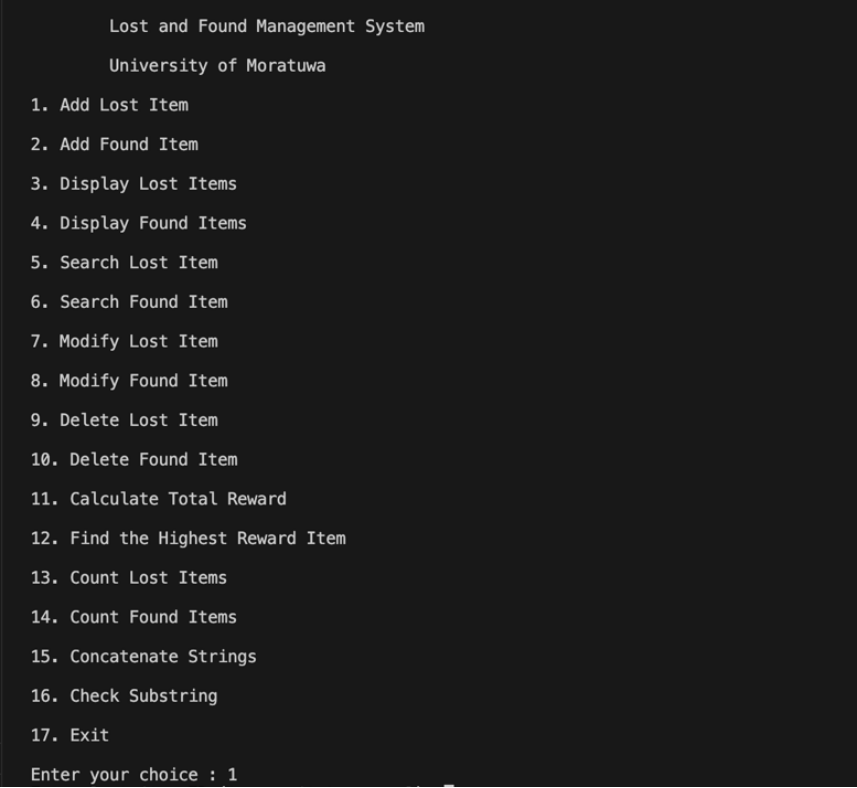

# lost-found-system-c
Console-based Lost and Found System using C
# Lost and Found System (C)

📌 Description

This project is a console-based Lost and Found Management System developed using the C programming language.
It is designed to help manage lost and found items within a university environment.

⚙️ Features

* Add lost items
* Add found items
* Search items
* Update item details
* Delete records

🛠️ Concepts Used

* Structures
* Arrays
* Functions
* String handling
* Basic CRUD operations (Create, Read, Update, Delete)

▶️ How to Run
1. Compile the program:
   gcc lost-found-system-uni.c -o program
2. Run the program:
   ./program

📷 Sample Output
1. Output
   

 2. Getting User Input
    

*Shows the program asking the user to enter data.*

 3. Example Run
    

*Example of a complete run with input and output.*

 📖 How It Works

The system uses structures to store details of lost and found items such as ID, name, location, and owner/finder.
Users can interact with the system through a menu-driven interface to perform operations like adding, searching, updating, and deleting records.

👨‍💻 Author
Siyara
